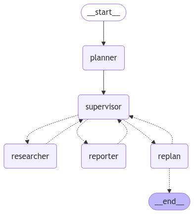

# AutoDS' SuperPlanner Demo

## Table of Contents
1. [Introduction](#introduction)
2. [Setup Instructions](#setup)
   - [WebUI Setup](#webui-setup)
   - [DeepSeek Setup](#deepseek-setup)
3. [Description](#langgraph-simple-agentic-structure-demo)
4. [Sample Output](#sample-output)
---

## Introduction
**AutoDS** is an intelligent multi-agent system powered by LLMs, designed to streamline data analysis and research workflows. By leveraging LangChain and LangGraph, AutoDS orchestrates specialized agents that autonomously execute tasks such as statistical analysis, visualization, and report generation. Our system integrates cutting-edge models like DeepSeek and tools like WebUI for seamless interaction and deployment. AutoDS enhances the Data-to-Paper workflow by structuring it into a cohesive, automated pipeline, enabling AI-driven decision-making and workflow optimization. The ultimate vision is for AutoDS to operate as a fully autonomous research assistant, intelligently managing and refining analytical processes from start to finish.


---

## Setup Instructions


## Setup

### 1. Clone the Repository
```bash
git clone https://github.com/aneesh27/SuperPlannerV1.git
cd SuperPlannerV1
```

### 2. Set Up a Virtual Environment
- **Windows**:
  ```bash
  python -m venv venv
  venv\\Scripts\\activate
  ```
- **macOS / Linux**:
  ```bash
  python3 -m venv venv
  source venv/bin/activate
  ```

### 3. Install Dependencies
Install the required dependencies using `uv pip` (or `pip` if `uv` is not available):
```bash
uv pip install -r requirements.txt
```
*Note: If `uv` is not installed, use `pip install -r requirements.txt`.*

### 4. Create a `.env` File
Create a `.env` file in the root directory and add your OpenAI API key:
```plaintext
OPENAI_API_KEY=your_api_key_here
```

### 5. Run the Application
Execute the main script to start the conversational agent:
```bash
python superPlanV3.py
```

---

## Command Reference

### Update `requirements.txt`
If you’ve added a new dependency, update the `requirements.txt` file:
```bash
pip freeze > requirements.txt
```

### Useful Git Commands
- **Check Status**:
  ```bash
  git status
  ```
- **Add Changes**:
  ```bash
  git add .
  ```
- **Commit Changes**:
  ```bash
  git commit -m "Your commit message"
  ```
- **Push Changes**:
  ```bash
  git push origin main
  ```
---

## LangGraph Simple Agentic Structure Demo

This demo shows how to build an AI-driven research and reporting system using LangChain and LangGraph. It implements an agentic workflow where an AI supervisor works in tandem with a Plan and Execute structure to urilize tools effectively. The system dynamically plans, executes, and refines tasks using OpenAI's GPT models, ensuring an iterative and structured approach to problem-solving.

---
## Links
### LangGraph:
1. [Plan and Execute](https://langchain-ai.github.io/langgraph/tutorials/plan-and-execute/plan-and-execute/)
2. [Supervisor](https://langchain-ai.github.io/langgraph/tutorials/multi_agent/agent_supervisor/)
---
## Graph

---

## Sample Output
```console
(venv) (venv) python superPlanV3.py
{'plan': ['Run ptest on the hypothetical data to analyze the impact of water seepage on construction and cement laying.', 'Generate a matplot visualization to illustrate the relationship between water seepage levels and the quality of cement laying.', 'Summarize the findings from the ptest and the matplot visualization, highlighting key trends and correlations.', 'Report the findings in detail, including the statistical significance of the results, visual aids from the matplot, and practical implications for construction practices.']}
{'next': 'researcher', 'past_steps': []}
2.1 Data is being tested using pandas2.2 Data is displayed using matplot

{'messages': [HumanMessage(content='The data has been successfully tested with the p-test, and a graph has been displayed using matplot. If you need further analysis or specific details, feel free to ask!', additional_kwargs={}, response_metadata={}, name='researcher', id='b26cd62d-7818-459a-a4eb-98ccc1180f5e')], 'past_steps': [('research', 'The data has been successfully tested with the p-test, and a graph has been displayed using matplot. If you need further analysis or specific details, feel free to ask!')]}
{'next': 'reporter', 'past_steps': [('research', 'The data has been successfully tested with the p-test, and a graph has been displayed using matplot. If you need further analysis or specific details, feel free to ask!')]}
3.1 Findings are being summarized3.2 All findings

{'messages': [HumanMessage(content='The findings from the analysis are as follows:\n\n### Summary:\nThere seems to be a strong correlation between groundwater pollution and construction on sandy soil.\n\n### Detailed Report:\nStudies and observations suggest that there is a significant relationship between groundwater pollution and construction on sandy soil. This correlation arises because sandy soil has high permeability, meaning that water and other substances can pass through it more easily compared to other soil types. When buildings, industrial facilities, or other structures are constructed on sandy terrain, pollutants from construction materials, chemicals, or waste can seep into the ground more rapidly. This increases the risk of contaminants reaching and polluting the groundwater supply. Additionally, because sand does not provide the same level of natural filtration as denser soils like clay, harmful substances are less likely to be trapped before they reach the groundwater.', additional_kwargs={}, response_metadata={}, name='reporter', id='fbe7deaa-5567-4ea5-afd8-588861ca4771')], 'past_steps': [('research', 'The data has been successfully tested with the p-test, and a graph has been displayed using matplot. If you need further analysis or specific details, feel free to ask!'), ('research', 'The data has been successfully tested with the p-test, and a graph has been displayed using matplot. If you need further analysis or specific details, feel free to ask!'), ('report', 'The findings from the analysis are as follows:\n\n### Summary:\nThere seems to be a strong correlation between groundwater pollution and construction on sandy soil.\n\n### Detailed Report:\nStudies and observations suggest that there is a significant relationship between groundwater pollution and construction on sandy soil. This correlation arises because sandy soil has high permeability, meaning that water and other substances can pass through it more easily compared to other soil types. When buildings, industrial facilities, or other structures are constructed on sandy terrain, pollutants from construction materials, chemicals, or waste can seep into the ground more rapidly. This increases the risk of contaminants reaching and polluting the groundwater supply. Additionally, because sand does not provide the same level of natural filtration as denser soils like clay, harmful substances are less likely to be trapped before they reach the groundwater.')]}
{'next': 'replan', 'past_steps': [('research', 'The data has been successfully tested with the p-test, and a graph has been displayed using matplot. If you need further analysis or specific details, feel free to ask!'), ('research', 'The data has been successfully tested with the p-test, and a graph has been displayed using matplot. If you need further analysis or specific details, feel free to ask!'), ('research', 'The data has been successfully tested with the p-test, and a graph has been displayed using matplot. If you need further analysis or specific details, feel free to ask!'), ('research', 'The data has been successfully tested with the p-test, and a graph has been displayed using matplot. If you need further analysis or specific details, feel free to ask!'), ('report', 'The findings from the analysis are as follows:\n\n### Summary:\nThere seems to be a strong correlation between groundwater pollution and construction on sandy soil.\n\n### Detailed Report:\nStudies and observations suggest that there is a significant relationship between groundwater pollution and construction on sandy soil. This correlation arises because sandy soil has high permeability, meaning that water and other substances can pass through it more easily compared to other soil types. When buildings, industrial facilities, or other structures are constructed on sandy terrain, pollutants from construction materials, chemicals, or waste can seep into the ground more rapidly. This increases the risk of contaminants reaching and polluting the groundwater supply. Additionally, because sand does not provide the same level of natural filtration as denser soils like clay, harmful substances are less likely to be trapped before they reach the groundwater.')]}
{'response': 'The findings from the analysis are as follows:\n\n### Summary:\nThere seems to be a strong correlation between groundwater pollution and construction on sandy soil.\n\n### Detailed Report:\nStudies and observations suggest that there is a significant relationship between groundwater pollution and construction on sandy soil. This correlation arises because sandy soil has high permeability, meaning that water and other substances can pass through it more easily compared to other soil types. When buildings, industrial facilities, or other structures are constructed on sandy terrain, pollutants from construction materials, chemicals, or waste can seep into the ground more rapidly. This increases the risk of contaminants reaching and polluting the groundwater supply. Additionally, because sand does not provide the same level of natural filtration as denser soils like clay, harmful substances are less likely to be trapped before they reach the groundwater.'}
```
---